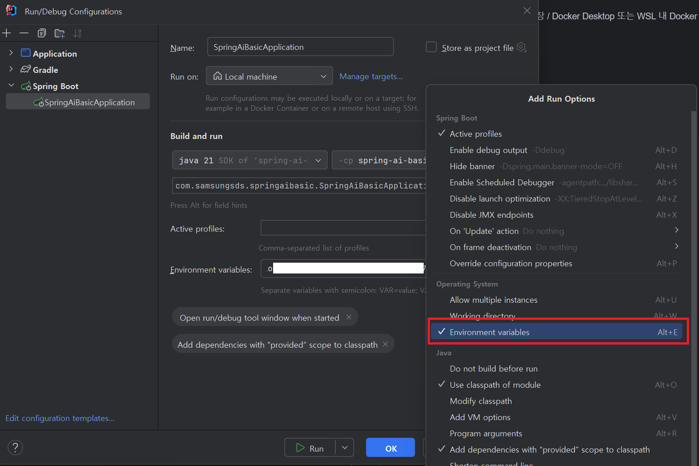

# Spring AI Hands-on 
### 이 Repository는 Spring AI 교육을 위해 만들었습니다.
 
 

## 교재 안내
교재는 이 Repository의 `doc`디렉토리 아래 다음과 같이 구성 되어 있습니다. 

| 파일명                                              | 설명                                      |
|--------------------------------------------------|-----------------------------------------|
| [00.사전환경설정.md](doc/00.사전환경설정.md)                 | 수강 전 준비 사항에 대한 안내                       |
| [01.Project시작.md](doc/01.Project시작.md)           | 개발환경 구성에 대한 안내                          |
| [02.단순한통신.md](doc/02.단순한통신.md)                   | 간단한 OpenAI API 호출 개발                    |
| [03.PromptTemplate.md](doc/03.PromptTemplate.md) | Prompt Template을 이용한 API호출 구성           |
| [04.VectorDB.md](doc/04.VectorDB.md)             | VectorDB에 데이터를 저장하는 방법에                 |
| [05.RAG.md](doc/05.RAG.md)                       | 이전 챕터에서 VectorDB에 저장 한 내용을 기반으로 한 RAG구성 |
| [06.Chatbot.md](doc/06.Chatbot.md)               | Stream을 사용한 실시간 응답 /  대화형 챗봇 개발         |
| [99.참고자료.md](doc/99.참고자료.md)                     | 추가 참고 자료                                |

## 개발환경 구성

 

- OS: Windows
- Platform: JDK(openjdk) 17 https://www.azul.com/downloads
- IDE: IntelliJ IDEA Community Edition
- 상세 내용은 교재 참고 ([00.사전환경설정.md](doc/00.사전환경설정.md))

 

## API Key 설정
예제 소스의 `application.properties` 파일에는 API Key가 환경 변수로 부터 받아오도록 되어 있다. 

Intellij에서는 다음과 같이 Run/Debug Configuraion을 통해 환경변수를 설정 할 수 있다.

