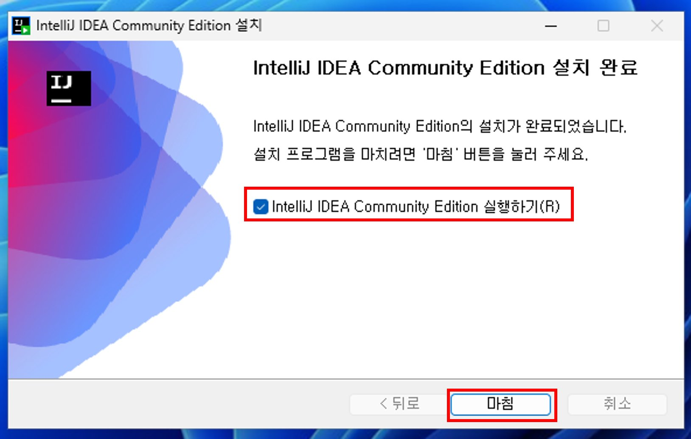

# SpringAI 과정 환경설정 가이드

## 실행 환경 개요
- OS: Windows
- Platform: JDK(openjdk) 17 ([https://www.azul.com/downloads](https://www.azul.com/downloads))
- IDE: IntelliJ IDEA Community Edition

## Java 설치
다음 사이트에 접속하여 JDK 17을 다운로드 받아 설치한다.
[https://www.azul.com/downloads](https://www.azul.com/downloads)

스크롤을 내려보면 다음과 같은 윈도우용 JDK17버전을 찾을 수 있다.
   

위 화면의 JDK를 설치 해 주면 된다. Download를 클릭하면 아래와 같이 다운로드 받을 파일을 선택할 수 있다.
   

.msi 를 클릭하여 다운로드 한다.
   

다운로드가 시작된다.
   

다운로드가 완료되면 클릭해서 설치를 시작한다.
   

Next를 클릭 해 준다.
   

Set JAVA_HOME을 체크하고 Next를 클릭 해 준다.
   

Install을 클릭하여 설치를 진행한다.
   

예를 선택한다. 
   

설치가 완료되면 Finish를 클릭한다.
   
   

## IntelliJ IDEA 설치
다음사이트에 접속해서 IntelliJ IDEA Community Edition을 다운로드 받아 설치한다. 
[https://www.jetbrains.com/ko-kr/idea/download/?section=windows](https://www.jetbrains.com/ko-kr/idea/download/?section=windows)

다운로드를 클릭하면 다음과 같은 화면을 솔 수 있다.
   

여기서 스크롤을 내리면 Community 버전을 찾을 수 있다.
   

다운로드 버튼을 클릭한다.
   

다운로드가 시작된다.
   

다운로드가 완료되면 클릭하여 설치를 시작한다.
   

예를 클릭한다. 
   

다음을 클릭한다. 
   

다음을 클릭한다. 
   

IntelliJ IDEA Community Edition의 데스크탑 바로가기를 생성하기를 선택하고 다음을 클릭한다. 
   

설치를 클릭한다.
   

설치가 완료되면 IntelliJ IDEA Community Edition 실행하기를 선택한 뒤 마침을 클릭 한다.
   

그러면 IntelliJ IDEA가 자동으로 실행 된다. 여기서 사용자 계약 약관에 체크 하고 계속을 클릭 해 준다. 
   

보내지 않음을 클릭 한다. 
   

이제 IntelliJ IDEA Community Edition이 실행되었다. 
IDE의 설정을 위해 Customize를 클릭 해 준다. 
   

화면이 밝은게 좋다면 Theme을 Light로 변경해 준다. 
다른 설정을 하기 위해 아래쪽에 `All settings`를 클릭 해 준다.
   

`Editor -> General -> Auto Import`로 들어간 뒤  
`Add unambiguous imports on the fly`와 `Optimize imports on the fly`를 체크 해 준다.  
   

`Build, Execution, Deployment -> build tools` 메뉴로 들어가서 `Reload project after changes in the build scripts`에서 `Any changes`를 선택한다.  
   

`Build, Execution, Deployment -> Compiler` 메뉴로 들어가서 `Build project automatically`를 체크 해 준다.  
OK를 눌러서 설정을 마무리 한다. 
   

## OpenAI API Key 발급
일단 OpenAI사이트에 가입을 해 준다. 가입은 사전설문 시 입력 해 준 이메일로 가입 합니다. 
가입 절차는 클릭만으로 간단히 진행할 수 있으므로 생략 하겠다. 

OpenAI에 가입을 완료하면 Organization에 초대 된 메일을확인한다.
사전설문 시 입력 한 이메일계정으로 들어가서 메일을 확인한다. 

`Accept invite` 버튼을 클릭하여 초대를 수락한다.

이후 `Continue`를 클릭해준다. 

다음과 같은 화면을 볼 수 있다. 여기서 주의 할 점은 Organization은 꼭 `GenAI Playground`로 선택 되어 있는것을 확인 해야 한다. 

API Key를 발급받기 위한 메뉴는 다음의 위치에 있다. 

1. 우측 상단에 `Dashboard`를 클릭힌다. 
2. 좌측 메뉴에 API Keys를 클릭한다. 
3. `Create new secret key`를 클릭한다.

이렇게 클릭하면 아래와 같이 새로 API Key를 생성 할 수 있는 화면이 나온다.

여기서 Name부분에 키 이름을 입력 해 준다. 내가 알아볼 수 있게만 적어주면 된다. 

이후 `Create secret key`를 클릭 해 준다. 

여기서 중요한것이 이 메뉴에서 생성 된 Key는 앞으로 다시는 볼 수 없다는 것이다. 
이후를 위해 키를 저장 해 주면 된다. 이후 과정에서 사용되는 OpenAI API Key는 이것을 사용한다고 보면 된다. 

   

## Pinecone API Key 발급
Pinecone API Key를 발급 받기 위해서는 다음 사이트에 접속한다. 
[https://www.pinecone.io/](https://www.pinecone.io/)

아래 이미지와 같이 Sign up을 클릭한다.

여러가지 가입 방법이 있는데, 이중 편한 내용을 골라 가입을 진행한다.

가입이 완료되면 다음과 같은 화면을 볼 수 있다. 여기서 좌측의 API Keys를 클릭한다.

API Keys메뉴로 들어오면 기본적으로 API Key가 생성 되어 있는걸 볼 수 있다. 
이 키를 가지고 Pinecone실습을 진행 할 예정이다.

