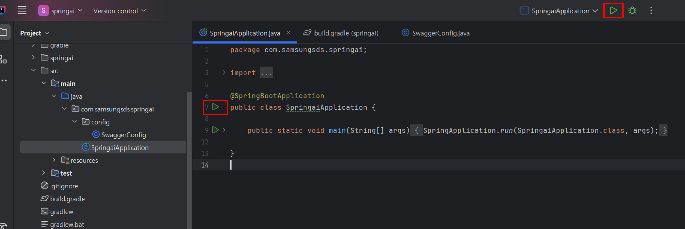

# Project 시작


## Spring boot 프로젝트 시작

다음 사이트에 접속하여 Spring boot초기 프로젝트를 다운로드 받는다.<br>
[https://start.spring.io/](https://start.spring.io/)
<br><br>
처음 접속하면 아래와 같은 화면이 보인다. 각각 항목에 다음과 같이 입력 하면 된다.


### 설정 항목
| 항목          | 설정              |
|-------------|-----------------|
| Project     | Gradle - Groovy |
| Language    | Java            |
| Spring Boot | 3.3.3           |

### Project Metadata
| 항목           | 설정                         |
|--------------|----------------------------|
| Group        | com.samsungsds             |
| Artifact     | springai                   |
| Name         | springai                   |
| Description  | Spring AI Hands-on Project |
| Package name | com.samsungsds.springai    |
| Packaging    | Jar                        |
| Java         | 17                         |

Java 버전은 17버전으로 설치 했으므로 17로 선택한다. 다만 다른 버전이 설치되어 있다면 그 버전으로 선택 하는것이 맞긴 하지만, 실습 예제는 17버전 에서 테스트 되었음을 참고 하자.  
설정값을 모두 입력 한 뒤`GENERATE` 버튼을 클릭하면 다운로드가 시작된다. 다운로드 받은 파일을 다음의 경로에 압축 해제 한다. 
<br><br><br>


교재에는 `c:\hdandson\springai` 경로를 기준으로 설명하고 있지만, 본인이 원하는 경로에 압축을 해제하면 된다. 
<br><br><br>


프로젝트를 불러오기 위해 IntelliJ IDEA를 실행하고 `Open`을 클릭한다.
<br><br><br>


압축을 해제한 프로젝트 폴더를 선택하고 `OK`를 클릭한다.
<br><br><br>


`Trust Project`를 클릭한다.
<br><br><br>


처음 프로젝트를 열면 자동으로 프로젝트 설정을 하느라 로딩하기 까지 시간이 좀 걸리낟. 위 이미지의 빨간 네모박스 안의 프로그래스바가 없어지면 로딩이 끝난 것이다. 
<br><br><br>


src/main/java/com.samsungsds.springai 경로에 `SpringaiApplication.java` 파일이 있는 것을 확인 할 수 있다. 이 파일을 열면 소스코드창에 플레이 버튼이 생긴다. 이 버튼은 프로젝트를 실행하는 버튼이다.
<br><br><br>


프로젝트를 실행하기 위해서 플레이버튼을 클릭하면 실행 옵션이 등장하는데 이 중 `Run 'SpringaiApplication main()'`을 클릭하면 프로젝트가 실행된다.
<br><br><br>


위와 같이 에러 없이 잘 실행되면 정상적으로 프로젝트 설정이 끝난 것이다.<br>
만약 정상적으로 실행되지 않는다면, 사전 환경설정에서 Java설치가 잘 되었는지, IntelliJ IDEA설치 후 설정들이 잘 적용 되어 있는지를 확인 해 봐야 한다. 
<br><br><br><br>


## Swagger UI 설정
Spring boot는 백앤드 시스템이고 별도의 화면을 제공하지 않는다. Postman과 같은 별도의 프로그램을 사용해서 REST API에 접근해도 되지만 Swagger는 자체 웹 서버를 실행하여 웹브라우저로 백앤드의 시스템에 접근할 수 있도록 해 준다. 
Swagger를 사용하면 다음의 이점들을 취할 수 있다.
<br>
* API 문서화: Swagger UI는 RESTful API의 구조를 시각적으로 보여주는 인터페이스를 제공합니다. 이를 통해 개발자들은 API의 엔드포인트, 요청 파라미터, 응답 형식 등을 쉽게 확인할 수 있습니다. 
* 테스트 용이성: Swagger UI를 통해 API를 직접 호출하고 결과를 확인할 수 있습니다. 이는 Postman과 같은 별도의 도구 없이도 API 테스트가 가능하게 해줍니다. 
* 커뮤니케이션 효율 향상 : 프론트 앤드와 백앤드 개발자간은 물론, 다른 서비스의 개발자들이나 기획자, 고객과의 소통에서 유용한 도구로 사용할 수 있다.
<br><br>
Swagger를 사용하기 위해서는 다음과 같은 설정이 필요하다.
<br><br>

먼저 build.gradle을 다음과 같이 작성한다. 

**build.gradle**
```groovy
plugins {
	id 'java'
	id 'org.springframework.boot' version '3.3.3'
	id 'io.spring.dependency-management' version '1.1.6'
}

group = 'com.samsungsds'
version = '0.0.1-SNAPSHOT'

java {
	toolchain {
		languageVersion = JavaLanguageVersion.of(17)
	}
}

repositories {
	mavenCentral()
}

// dependencies 부분이 가져올 외부 라이브러리를 명시하는 부분이다.
dependencies {
	implementation 'org.springframework.boot:spring-boot-starter'
	implementation 'org.springdoc:springdoc-openapi-starter-webmvc-ui:2.5.0' //	Swagger UI
	implementation 'org.springframework.boot:spring-boot-starter-web'        // Spring boot web  

	testImplementation 'org.springframework.boot:spring-boot-starter-test'
	testRuntimeOnly 'org.junit.platform:junit-platform-launcher'
}

tasks.named('test') {
	useJUnitPlatform()
}


```
<br><br><br><br>

Swagger UI설정을 위한 설정 파일 추가를 위해 Package를 생성한다.


<br><br>
다음과 같이 패키지 이름을 입력 해 준다. 

| 패키지 경로                         | 
|--------------------------------|
| com.samsungsds.springai.config | 


<br><br>

새로 만들어준 패키지에 새로운 파일을 생성 해 준다. 


| 파일이름          |
|---------------|
| SwaggerConfig |

<br><br>
새로 생성 한 SwaggerConfig파일에 다음과 같은 내용을 채워 넣어준다. 

**SwaggerConfig.java**
```java
package com.samsungsds.springai.config;

import io.swagger.v3.oas.models.Components;
import io.swagger.v3.oas.models.OpenAPI;
import org.springframework.context.annotation.Bean;
import org.springframework.context.annotation.Configuration;
import io.swagger.v3.oas.models.info.Info;

@Configuration
public class SwaggerConfig {

    @Bean
    public OpenAPI openAPI() {
        return new OpenAPI()
                .components(new Components())
                .info(new Info()
                        .title("AI API Page")
                        .description("Chat모델을 사용하는 페이지")
                        .version("1.0.0"));
    }
}

```
위 소스코드는 Swagger-UI를 위한 설정이다. OpenAPI형식의 Bean을 생성 하면서 메인 페이지에 표시 할 title, description, version에 대해 간단하게 명시하고 있다. 


<br><br>
소스코드를 완성하고 난 뒤 프로젝트를 실행하면 Swagger UI가 실행되는 것을 확인 할 수 있다.

다음의 버튼을 클릭 하여 Spring boot프로젝트를 실행한다. 

<br><br>
실행한 뒤 웹브라우저에 `http://localhost:8080/swagger-ui.html`을 입력하면 Swagger UI가 실행되는 것을 확인 할 수 있다.

<br><br>

