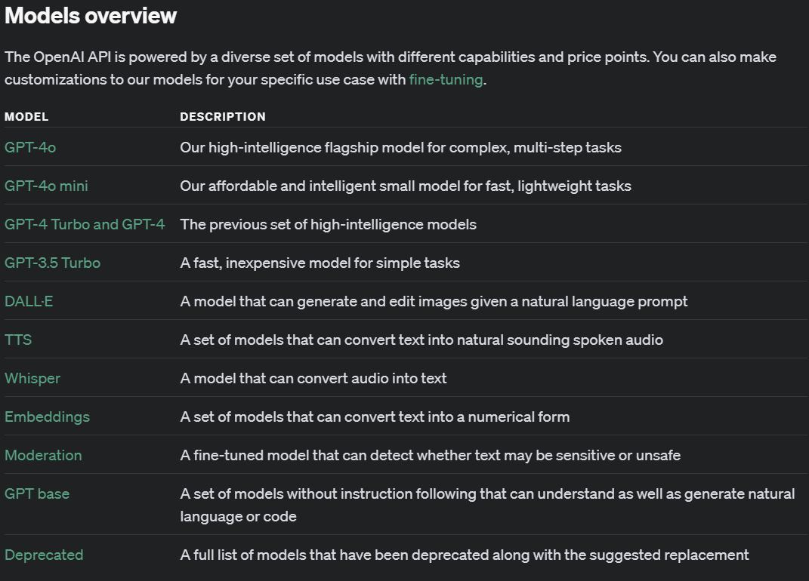

# 단순 API통신

가장 간단한 예제부터 구현 해 보려고 한다. 응용프로그램을 만들기 전, 우리가 만든 App과 OpenAPI간의 통신을 통해 간단한 텍스트 데이터를 주고 받는 예제를 만들어 보려고 한다. 다음 내용을 따라 진행 해 보자.

## build.gradle 설정
항상 모든 새로운 기능을 사용하기 위해서는 외부에서 어떤 라이브러리를 가져올지를 명시 해 주어야 한다. 그런데 우리가 사용 하고자 하는 Spring AI 라이브러리를 가져오기 위해서는 다음의 repository를 추가 해 줘야 받아올 수 있다. 

```groovy
repositories {
	mavenCentral()
	maven { url 'https://repo.spring.io/milestone' }
	maven { url 'https://repo.spring.io/snapshot' }
}
```

그리고 다음의 라이브러리를 추가 해 주면 된다. 
```groovy
	implementation platform("org.springframework.ai:spring-ai-bom:1.0.0-SNAPSHOT")  //Spring AI 라이브러리 추가
	implementation 'org.springframework.ai:spring-ai-openai-spring-boot-starter'    //Spring AI Starter 추가
```
<br><br>
두 수정사항을 합친 최종 build.gradle 파일은 다음과 같다.   

**build.gradle**
```groovy

plugins {
    id 'java'
    id 'org.springframework.boot' version '3.3.3'
    id 'io.spring.dependency-management' version '1.1.6'
}

group = 'com.samsungsds'
version = '0.0.1-SNAPSHOT'

java {
    toolchain {
        languageVersion = JavaLanguageVersion.of(17)
    }
}

repositories {
    mavenCentral()
    maven { url 'https://repo.spring.io/milestone' }
    maven { url 'https://repo.spring.io/snapshot' }
}

dependencies {
    implementation 'org.springframework.boot:spring-boot-starter'
    implementation 'org.springdoc:springdoc-openapi-starter-webmvc-ui:2.5.0'
    implementation 'org.springframework.boot:spring-boot-starter-web'

    implementation platform("org.springframework.ai:spring-ai-bom:1.0.0-SNAPSHOT")  //Spring AI 라이브러리 추가
    implementation 'org.springframework.ai:spring-ai-openai-spring-boot-starter'    //Spring AI 라이브러리 추가

    testImplementation 'org.springframework.boot:spring-boot-starter-test'
    testRuntimeOnly 'org.junit.platform:junit-platform-launcher'

}

tasks.named('test') {
    useJUnitPlatform()
}


```

## OpenAI API Key 설정

OpenAI API를 사용하기 위해서 발급 한 API Key를 설정 해 주기 위해 application.properties 파일을 수정해 준다. 
```properties
spring.application.name=spring-ai-basic
spring.ai.openai.chat.options.model=gpt-3.5-turbo-0125
spring.ai.openai.api-key=sk-proj-XXXXXXXXXXXXXXXXXXXXXXXXXXXXXXXXXXXXXXXXXXXXXXXX
```

최초에 spring.application.name값이 다른 값이 들어가 있을 것이다. 이것을 `spring-ai-basic`으로 변경 해 준다. 
그리고 하용 할 모델을 gpt-3.5-turbo-0125로 설정 해 준다. 현재 사용 가능한 모델은 다음과 같다. 



가장 좋은 모델은 현재로써는 GPT-4o이지만, 이 시간에 다루는 내용이 고성능의 모델이 필요하지 않으므로 비용대비 효용을 고려하여 GPT-3.5모델을 사용 할 예정이다. 

## ChatClient 생성

OpenAI API를 사용하기 위해서는 ChatClient를 생성해야 한다.
별도의 설정 없이 다음과 같이 기본적인 ChatClient를 생성 해 주자.

| 패키지 경로                         | 파일이름             |
|--------------------------------|------------------|
| com.samsungsds.springai.config | ChatClientConfig |

**ChatClientConfig.java**
```java
package com.samsungsds.springai.config;

import org.springframework.ai.chat.client.ChatClient;
import org.springframework.context.annotation.Bean;
import org.springframework.context.annotation.Configuration;

@Configuration
class ChatClientConfig {

    @Bean
    ChatClient chatClient(ChatClient.Builder builder) {
        return builder.build();
    }

}
```
정말 간단한 ChatClient를 생성 해 주었다. 

<br><br>

## Model 생성
사용자와 브라우저간 통신을 위해 사용되는 모델을 만들어 주도록 하자. 단순한 데이터만 주고 받을꺼라 사실 String형식으로 해도 되지만, 간단하게 구현할 수 있는 record형식의 클래스를 만들어 보겠다.

다음의 경로로 신규 패키지를 만들어 준다.

| 패키지 경로                        |
|-------------------------------|
| com.samsungsds.springai.model |

신규로 생성 한 패키지에 다음과 같은 이름의 클래스를 생성 해 준다.

| 파일이름 |
|----|
| Answer |

Answer 클래스에 다음의 코드를 작성 해 준다. 

**Answer.java**
```java
package com.samsungsds.springai.model;

public record Answer(String answer) {
}
```
정말 간단한 코드이다. 여기서 record형식이 익숙하지 않은 분들을위해 다음과 같이 간단하게 설명 하도록 하겠다. 

record는 Java 14부터 추가된 기능으로, 데이터를 저장하는 클래스를 간단하게 만들 수 있게 해준다. record는 final이기 때문에 상속이 불가능하고, 내부적으로 equals(), hashCode(), toString() 메소드를 자동으로 생성해 준다. Immutable한 객체를 만들기 위해 사용되며, 데이터를 저장하는 목적으로 사용된다.  Immutable이므로 생성 이후에 데이터를 변경하는 것은 불가능하다.

따라서 지금과 같이 비즈니스 로직에서 데이터를 수정하지 않고 단순 전달 목적의 객체에 서 사용하기에 적합하다.

같은 record형식으로 Question 클래스도 만들어 주도록 하자.

| 패키지 경로                        |
|-------------------------------|
| com.samsungsds.springai.model |

| 파일이름     |
|----------|
| Question |

Question 클래스에 다음의 코드를 작성 해 준다. 

**Question.java**
```java
package com.samsungsds.springai.model;

public record Question(String question) {
}
```


## Service 생성

이제 OpenAI API와 통신을 위한 Service를 생성 해 보도록 하자. 여기서는 복잡한 비즈니스로직이 필요하지 않기 때문에 다음과 같이 간단하게 구현 하면 된다. 

먼저 Service 패키지를 만들어준다.

| 패키지 경로                          |
|---------------------------------|
| com.samsungsds.springai.service |

그리고 인터페이스를 생성 해 준다.

| 파일이름        |
|-------------|
| ChatService |

ChatService에 다음의 코드를 작성 해 준다. 

**ChatService.java**
```java
package com.samsungsds.springai.service;

import com.samsungsds.springai.model.*;

public interface ChatService {

    Answer getAnswer(Question question);

}
```

| 파일이름            |
|-----------------|
| ChatServiceImpl |

ChatServiceImpl에 다음의 코드를 작성 해 준다.

**ChatServiceImpl.java**
```java
package com.samsungsds.springai.service;

import com.samsungsds.springai.model.Answer;
import com.samsungsds.springai.model.Question;
import org.springframework.ai.chat.client.ChatClient;
import org.springframework.stereotype.Service;

@Service
public class ChatServiceImpl implements ChatService {
    private final ChatClient chatClient;

    public ChatServiceImpl(ChatClient chatClient) {
        this.chatClient = chatClient;
    }

    @Override
    public Answer getAnswer(Question question) {
        String content = chatClient.prompt()
                .user(question.question())
                .call()
                .content();
        return new Answer(content);
    }
}

```


## ChatController 생성

이제 ChatClient를 사용하여 OpenAI API와 통신하는 REST API를 제공 해 줄 Controller를 생성해 보자.
REST API를 어떻게 설계 할 지는이 과정의 범위에서 벗어나므로, 간단하게 구성 하려고 한다. 

지금 만드는 Controller를 통해 사용자로 부터 텍스트 데이터를 받으면, 이를 OpenAI에 전달하고, 응답을 다시 사용자에게 전달 해 주는 로직으로 동작 할 예정이다. 

사용자로 부터 데이터를 받으니 POST형식의 REST API를 작성 해 보겠다. 

다음의 경로로 신규 패키지를 만들어 준다.

| 패키지 경로                             | 
|------------------------------------|
| com.samsungsds.springai.controller |
<br>
새로 만들어준 패키지에 새로운 파일을 생성 해 준다.

| 파일이름           |
|----------------|
| ChatController |
<br>
생성된 파일에 다음의 코드를 작성 해 준다. 


**ChatController.java**
```java
package com.samsungsds.springai.controller;

import com.samsungsds.springai.model.Answer;
import com.samsungsds.springai.model.Question;
import com.samsungsds.springai.service.ChatService;
import io.swagger.v3.oas.annotations.Operation;
import io.swagger.v3.oas.annotations.Parameter;
import org.springframework.stereotype.Controller;
import org.springframework.web.bind.annotation.PostMapping;
import org.springframework.web.bind.annotation.RequestBody;
import org.springframework.web.bind.annotation.ResponseBody;

import java.util.logging.Logger;

@Controller
public class ChatController {

    private final Logger logger = Logger.getLogger(ChatController.class.getName());

    private final ChatService chatService;

    public ChatController(ChatService chatService) {
        this.chatService = chatService;
    }

    @PostMapping("/ask")
    @ResponseBody
    @Operation(summary = "자유 프롬프트 실행", description = "별도 포멧 없이 사용자의 입력을 그대로 실행")
    public Answer askQuestion(@Parameter(description = "실행 할 프롬프트") @RequestBody Question question) {
        return chatService.getAnswer(question);
    }

}

```

## 실행

이제 모든 파일이 만들어졌다. 프로젝트를 실행 하고 Swagger UI를 통해 API를 테스트 해 보도록 하자.

이전에 실행 했던것과 동일하게 아래 실행 버튼을 누르면 실행할 수 있다. 


<br><br>
프로젝트를 실행 하고, 브라우저에서 `http://localhost:8080/swagger-ui.html`로 접속하면 Swagger UI가 나타난다.


위와 같이 새로 생성 한 `/ask` API를 볼 수 있다.

<br><br>
이를 클릭하면 아래와 같이 실행 시킬 수 있는 화면을 볼 수 있다.

여기서 Try it out을 클릭 하면 다음과 같이 입력창이 나타난다.

<br><br>

question 항목에 프롬프트를 입력 해 준다. 간단한 테스트 이므로 `대한민국의 수도는 어디인가?` 라고 입력 해 보자.

<br><br>

정상적으로 수행 되었다면 위와 같은 결과를 볼 수 있다. 