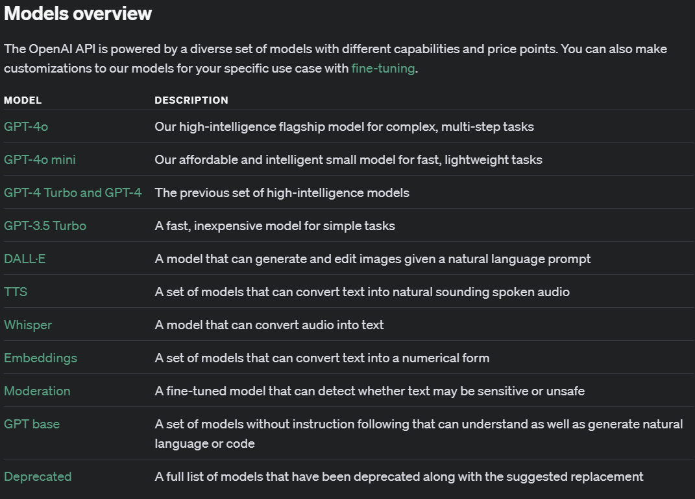

# Prompt Template

## Prompt Template을 활용한 OpenAI API 사용

프롬프트 탬플릿을 사용하면 유사한 유형의 질문이나 작업에 대해 일관된 형식의 프롬프트를 생성할 수 있다. 
이는 곧 결과의 일관성을 높이는 데에도 도임이 되면, 일관 된 형식의 프롬프트가 고도로 정제되어 있다면 일관되게 좋은 품질의 결과를 받아 볼 수 도 있다는 뜻이다. 

본 실습에서는 간단하게 수도를 물어보는 질문에 대한 답변을 받아보는 예제를 만들어 보도록 하겠다.


## build.gradle 설정
이전장인 02.단순한통신.md를 수행하지 않았다면 다음의 내용을 `build.gradle`에 반영 해 주도록 하자. 

```groovy
repositories {
	mavenCentral()
	maven { url 'https://repo.spring.io/milestone' }
	maven { url 'https://repo.spring.io/snapshot' }
}
```

그리고 다음의 라이브러리를 추가 해 주면 된다.
```groovy
	implementation platform("org.springframework.ai:spring-ai-bom:1.0.0-SNAPSHOT")  //Spring AI 라이브러리 추가
	implementation 'org.springframework.ai:spring-ai-openai-spring-boot-starter'    //Spring AI Starter 추가
```
<br><br>
두 수정사항을 합친 최종 build.gradle 파일은 다음과 같다.

**build.gradle**
```groovy

plugins {
    id 'java'
    id 'org.springframework.boot' version '3.3.3'
    id 'io.spring.dependency-management' version '1.1.6'
}

group = 'com.samsungsds'
version = '0.0.1-SNAPSHOT'

java {
    toolchain {
        languageVersion = JavaLanguageVersion.of(17)
    }
}

repositories {
    mavenCentral()
    maven { url 'https://repo.spring.io/milestone' }
    maven { url 'https://repo.spring.io/snapshot' }
}

dependencies {
    implementation 'org.springframework.boot:spring-boot-starter'
    implementation 'org.springdoc:springdoc-openapi-starter-webmvc-ui:2.5.0'
    implementation 'org.springframework.boot:spring-boot-starter-web'

    implementation platform("org.springframework.ai:spring-ai-bom:1.0.0-SNAPSHOT")  //Spring AI 라이브러리 추가
    implementation 'org.springframework.ai:spring-ai-openai-spring-boot-starter'    //Spring AI 라이브러리 추가

    testImplementation 'org.springframework.boot:spring-boot-starter-test'
    testRuntimeOnly 'org.junit.platform:junit-platform-launcher'

}

tasks.named('test') {
    useJUnitPlatform()
}


```


## OpenAI API Key 설정

OpenAI API를 사용하기 위해서 발급 한 API Key를 설정 해 주기 위해 application.properties 파일을 수정해 준다.
```properties
spring.application.name=spring-ai-basic
spring.ai.openai.chat.options.model=gpt-4o-mini-2024-07-18
spring.ai.openai.api-key=sk-proj-XXXXXXXXXXXXXXXXXXXXXXXXXXXXXXXXXXXXXXXXXXXXXXXX
```

최초에 spring.application.name값이 다른 값이 들어가 있을 것이다. 이것을 `spring-ai-basic`으로 변경 해 준다.
그리고 하용 할 모델을 gpt-4o-mini-2024-07-18로 설정 해 준다. 현재 사용 가능한 모델은 다음과 같다.



가장 좋은 모델은 현재로써는 GPT-4o이지만, 이 시간에 다루는 내용이 고성능의 모델이 필요하지 않으므로 비용대비 효용을 고려하여 GPT-3.5모델을 사용 할 예정이다.

## ChatClient 생성

OpenAI API를 사용하기 위해서는 ChatClient를 생성해야 한다.
별도의 설정 없이 다음과 같이 기본적인 ChatClient를 생성 해 주자.

| 패키지 경로                         | 파일이름             |
|--------------------------------|------------------|
| com.samsungsds.springai.config | ChatClientConfig |

**ChatClientConfig.java**
```java
package com.samsungsds.springai.config;

import org.springframework.ai.chat.client.ChatClient;
import org.springframework.context.annotation.Bean;
import org.springframework.context.annotation.Configuration;

@Configuration
class ChatClientConfig {

    @Bean
    ChatClient chatClient(ChatClient.Builder builder) {
        return builder.build();
    }

}
```
정말 간단한 ChatClient를 생성 해 주었다.

<br><br>


## Model 생성
이전에 만들어두었던 Model이 위치 한 패키지에 다음의 모델들을 생성 해 준다. 

| 패키지 경로                        |
|-------------------------------|
| com.samsungsds.springai.model |

여기에 다음과 같은 이름의 클래스를 생성 해 준다.

| 파일이름           |
|----------------|
| CapitalRequest |

내용은 아래과 같이 작성 해 준다. 

**CapitalRequest.java**
```java
package com.samsungsds.springai.model;

public record CapitalRequest(String country) {
}
```
이 모델은 사용자의 요청을 받는 역할을 한다. 사실 Question.java와 같은 역할을 하고 내용도 같지만, Swagger-ui상에서 구분을 하기 위해 새로 생성 해 주자.
<br><br>
그리고 응답을 위한 클래스도 생성 해 준다. 

| 파일이름            |
|-----------------|
| CapitalResponse |

**CapitalResponse.java**
```java
package com.samsungsds.springai.model;

public record CapitalResponse(String answer) {
}
```

## Prompt Template 생성


Spring AI에서는 `org.springframework.core.io.Resource` 추상화를 지원하여 프롬프트 데이터를 파일에 저장하고 이를 PromptTemplate에서 직접 사용할 수 있다. 
이 방식을 사용하면 프롬프트를 코드와 분리하여 관리할 수 있어 유지보수가 용이해진다. 

먼저 프롬프트를 저장 해 둘 파일을 생성 해 보자

| 파일 경로                      | 파일이름                  |
|----------------------------|-----------------------|
| src/main/resources/prompts | get-capital-prompt.st |

파일을 생성 했으면 다음과 같이 간단한 프롬프트를 입력 해 주도록 하자. 

**get-capital-prompt.st**
```
{country} 의 수도는 어디인가?
```


여기서 {country}라고 되어있는 부분은 나중에 해당항목을 시스템이 다른 문구로 치환 해 주게 된다. 


## Service 생성
Service는 기존에 생성 했던 클래스에 추가로 생성 해 준다.

| 패키지 경로                          | 파일이름        |
|---------------------------------|-------------|
| com.samsungsds.springai.service | ChatService |

여기에 수도를 물어보는 질문에 대답하기위한 Method를 추가 해 준다. 

```java
package com.samsungsds.springai.service;

import com.samsungsds.springai.model.*;

public interface ChatService {
    
    CapitalResponse getCapital(CapitalRequest capitalRequest); // 추가 된 Method

}
```

구현체에 실제 동작하는 코드를 작성 해 준다.  

| 패키지 경로                          | 파일이름            |
|---------------------------------|-----------------|
| com.samsungsds.springai.service | ChatServiceImpl |

```java 
package com.samsungsds.springai.service;


import com.samsungsds.springai.model.CapitalRequest;
import com.samsungsds.springai.model.CapitalResponse;
import org.springframework.ai.chat.client.ChatClient;
import org.springframework.ai.chat.prompt.PromptTemplate;
import org.springframework.beans.factory.annotation.Value;
import org.springframework.core.io.Resource;
import org.springframework.stereotype.Service;

import java.util.Map;

@Service
public class ChatServiceImpl implements ChatService {
    private final ChatClient chatClient;

    @Value("classpath:prompts/get-capital-prompt.st")
    private Resource capitalPrompt;

    public ChatServiceImpl(ChatClient chatClient) {
        this.chatClient = chatClient;
    }

    // 새로 추가 된 Method
    @Override
    public CapitalResponse getCapital(CapitalRequest capitalRequest) {
        PromptTemplate promptTemplate = new PromptTemplate(capitalPrompt);
        // 사용자로부터 입력받은 값을 Prompt에 country항목에 치환하여 사용한다. 
        String promptMessage = String.valueOf(promptTemplate.create(Map.of("country", capitalRequest.country())));
        String content = chatClient.prompt()
                .user(promptMessage)
                .call()
                .content();
        return new CapitalResponse(content);
    }
}

```
<br><br>
아래 구문은 미리 정의 된 프롬프트 탬플릿을 불러오는 부분이다.  
```java
    @Value("classpath:prompts/get-capital-prompt.st")
    private Resource capitalPrompt;
```
이전 항목에서 만들어줬던 `get-capital-prompt.st`파일을 불러 오게 된다. 불러 온 파일은 다음 코드에서`PromptTemplate`을 통해 사용자의 입력값을 치환하여 사용하게 된다.
```java 
PromptTemplate promptTemplate = new PromptTemplate(capitalPrompt);
String promptMessage = String.valueOf(promptTemplate.create(Map.of("country", capitalRequest.country())));

```

이렇게 생성 한 프롬프트는 다음에 보여지는 항목에서 user프롬프트로 OpenAI에 넘겨주게 된다. 

```java
        String content = chatClient.prompt()
                .user(promptMessage) // user 프롬프트
                .call()
                .content();
```

## Controller 생성

이제 ChatClient를 사용하여 OpenAI API와 통신하는 REST API를 제공 해 줄 Controller를 생성해 보자.
기존에 만들었던 Controller에 추가 해 준다. 

| 패키지 경로                             | 파일이름           |
|------------------------------------|----------------|
| com.samsungsds.springai.controller | ChatController |

**ChatController.java**
```java

package com.samsungsds.springai.controller;


import com.samsungsds.springai.model.CapitalRequest;
import com.samsungsds.springai.model.CapitalResponse;
import com.samsungsds.springai.service.ChatService;
import io.swagger.v3.oas.annotations.Operation;
import io.swagger.v3.oas.annotations.Parameter;
import org.springframework.stereotype.Controller;
import org.springframework.web.bind.annotation.PostMapping;
import org.springframework.web.bind.annotation.RequestBody;
import org.springframework.web.bind.annotation.ResponseBody;

import java.util.logging.Logger;

@Controller
public class ChatController {

    private final Logger logger = Logger.getLogger(ChatController.class.getName());

    private final ChatService chatService;

    public ChatController(ChatService chatService) {
        this.chatService = chatService;
    }
    
    @PostMapping("/capital")
    @ResponseBody
    @Operation(summary = "수도 프롬프트 실행", description = "아래의 프롬프트를 실행한다. : <br>" +
            " {country} 의 수도는 어디인가?<br> ")
    public CapitalResponse getCapital(@Parameter(description = "수도를 알고싶은 국가나 주 이름 -> {country}", example = "대한민국") @RequestBody CapitalRequest capitalRequest) {
        return this.chatService.getCapital(capitalRequest);
    }

}
```

## 실행

이제 완성 된 프로젝트를 실행 시켜 보도록 하자. 이전의 과정과 동일한 방밥으로 실행 시키면 된다.

실행을 시키면 다음과 같이 REST API가 추가 된 것을 확인할 수 있다. 


/capital 을 클릭하면 다음과 같이 실행 해 볼 수 있다.


실행의 결과는 다음과 같다.  


이와같이 "호주"라는 국가 이름만 입력했음에도 결과물은 해당 국가의 수도를 출력 해 주는 시스템을 만들 수 있다. 

## 프롬프트 개선 

프롬프트를 개선하여 정형화 된 출력을 만들어 내도록 수정 해 보자. 이전에 생성 했던 `get-capital-prompt.st`파일을 다음과 같이 수정 해 주자.

**get-capital-prompt.st**
```
{country} 국가에 대해 """기호 안에 있는 예시와 같이 출력 하여라.
``` 안에 해당 국가에 대한 내용을 채워 넣어라. 최종 출력물에서 ```기호는 표시하지 말아라. 
예시 이외에 다른 문구는 출력 하지 말아라.
"""
{country}의 수도는 ```capital```.
인구는 ```population```.
언어는 ```language```.
통화는 ```currency```.
"""
```

위와같이 프롬프트를 수정 하면 다음과 같이 결과를 받을 수 있다.


