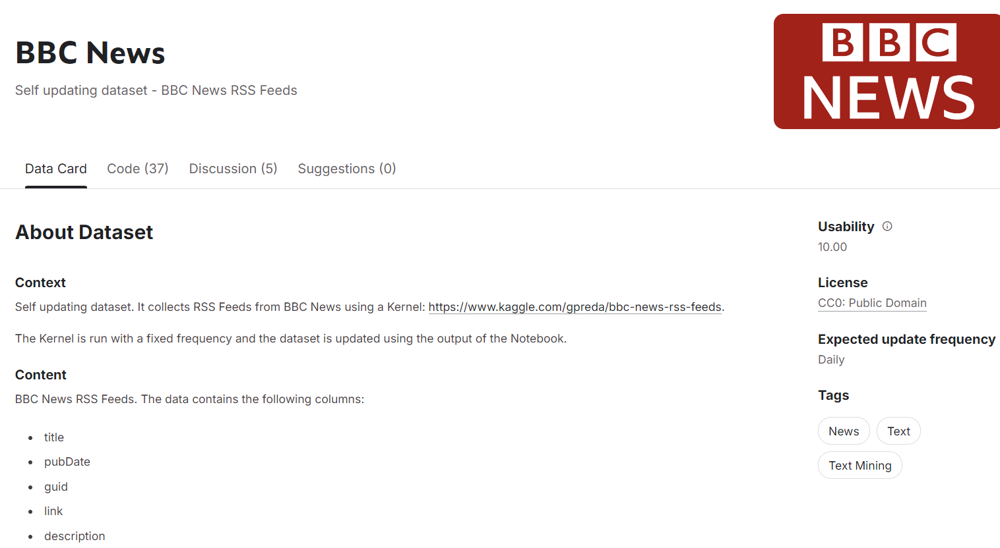
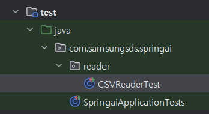
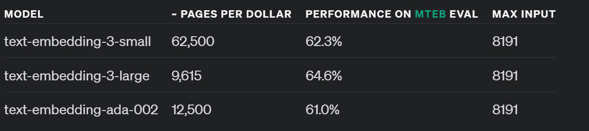
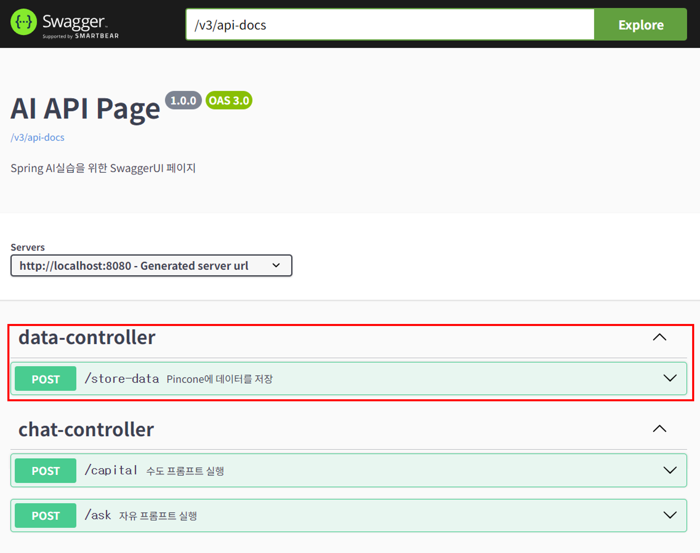
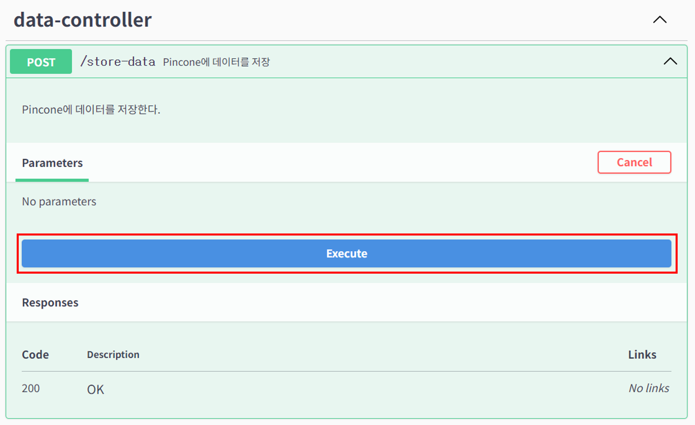
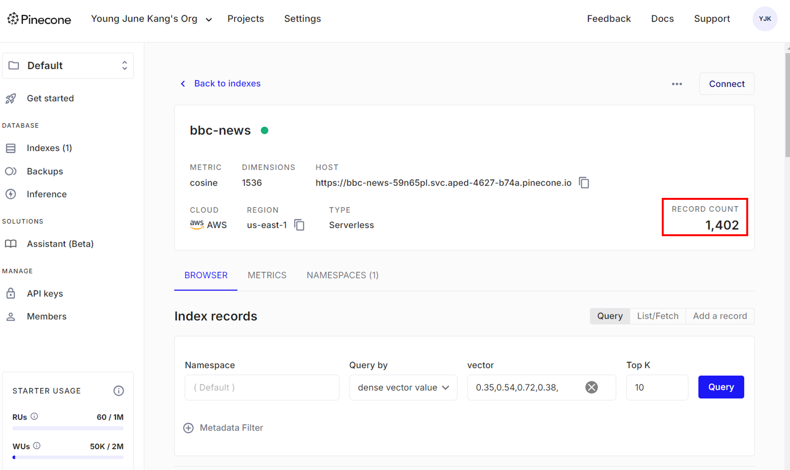
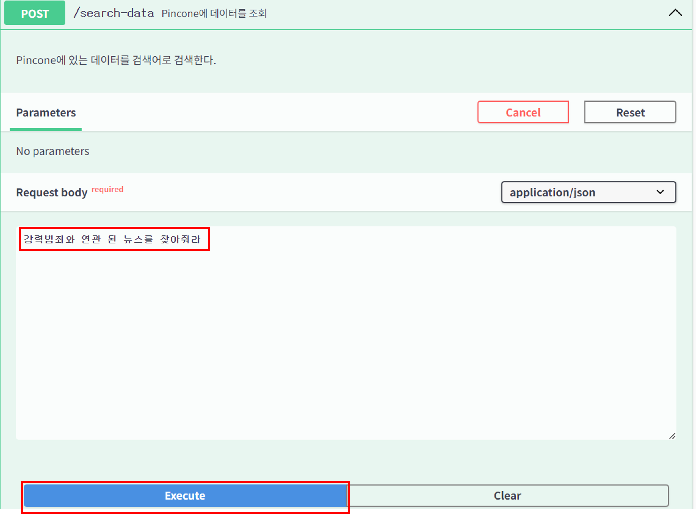
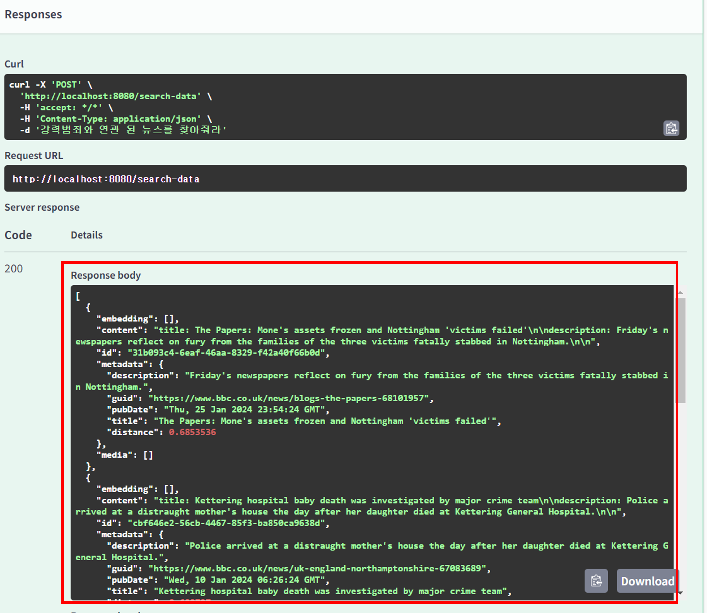

# Vector Database
 
벡터 데이터베이스는 AI 애플리케이션에서 필수적인 역할을 하는 데이터베이스이다. 
기존의 데이터베이스는 정확하게 일치하는 데이터를 검색하는 반면, 백터 데이터베이스는 유사도를 검색 해 준다.
이론시간에도 설명 했다시피, VectorDB에 데이터를 넣기 위해서는 데이터를 정제 후 Embedding과정을 거쳐야 한다. 
본 실습에서는 데이터 추출, Embedding, 저장의 과정을 실습 할 예정이다. 


## 데이터 읽기 
Spring AI 에서는 데이터를 읽을 때 여러가지 유형의 데이터를 읽어올 수 있다. 본 실습에서는 다음의 데이터를 읽어오도록 하겠다.
<br><br>

테스트용 데이터를 받을 수 있는 Kaggle에서 BBC뉴스 자료를 사용 하도록 할 예정이다. 

[https://www.kaggle.com/datasets/gpreda/bbc-news](https://www.kaggle.com/datasets/gpreda/bbc-news)

<br><br>
이 데이터는 다음과 같은 구조로 되어 있다. 

| title | pubDate | guid | description | 
|-------|---------|------|-------------|
| Disney's earliest Mickey and Minnie Mouse enter public domain as US copyright expires | Mon, 01 Jan 2024 05:00:08 GMT | https://www.bbc.co.uk/news/entertainment-arts-67833411 | Disney's copyright on the earliest version of the cartoon characters expires in the US on 1 January. |


RAG 시스템을 구축할 때 데이터를 어떻게 정리할지는 굉장히 중요한 이슈이지만, 다루는 데이터의 특성에 따라 다르므로 이번 실습에서는 정리 되어 있는 데이터를 사용 하도록 하겠다.

그렇지만 이렇게 정리 되어 있는 데이터 라고 하더라도, 어떤 데이터를 백터화 시킬지, 어떤 데이터를 메타 데이터로 넣어놓을지에 대해서는 고민이 필요하다. 
본 실습에서는 title과 description 관련 질의에 대해 처리하는 시스템이라고 가정하고, 이 두개 항목을 백터화 하도록 하겠다. 
나머지는 메타 데이터로 삽입 하려고 한다. 

Spring은 오래 된 프레임워크인 만큼, 이런 데이터를 다루는데 사용되는 많은 라이브러리와 많은 사용 사례를 가지고 있다는것이 굉장한 장점이다.

먼저 공유 받은 파일은 다음의 경로에 위치시킨다.

| 패키지 경로              | 파일이름         |
|---------------------|--------------|
| /src/main/resources | bbc_news.csv |


이번 실습에서는 Apache commons CSV 라이브러리를 사용하여 데이터를 읽어오도록 하겠다.
[https://commons.apache.org/proper/commons-csv/](https://commons.apache.org/proper/commons-csv/)


build.gradle에 다음과 같은 의존성을 추가 해 주도록 하자. 

```groovy
implementation group: 'org.apache.commons', name: 'commons-csv', version: '1.11.0'
```

위 내용이 반영 된 전체 build.gradle은 다음과 같다. 

**build.gradle**
```groovy
plugins {
	id 'java'
	id 'org.springframework.boot' version '3.3.3'
	id 'io.spring.dependency-management' version '1.1.6'
}

group = 'com.samsungsds'
version = '0.0.1-SNAPSHOT'

java {
	toolchain {
		languageVersion = JavaLanguageVersion.of(17)
	}
}

repositories {
	mavenCentral()
	maven { url 'https://repo.spring.io/milestone' }
	maven { url 'https://repo.spring.io/snapshot' }
}

dependencies {
	implementation 'org.springframework.boot:spring-boot-starter'
	implementation 'org.springdoc:springdoc-openapi-starter-webmvc-ui:2.5.0'
	implementation 'org.springframework.boot:spring-boot-starter-web'

	implementation platform("org.springframework.ai:spring-ai-bom:1.0.0-SNAPSHOT")  
	implementation 'org.springframework.ai:spring-ai-openai-spring-boot-starter'    

	implementation group: 'org.apache.commons', name: 'commons-csv', version: '1.11.0' // Apache commons CSV

	testImplementation 'org.springframework.boot:spring-boot-starter-test'
	testRuntimeOnly 'org.junit.platform:junit-platform-launcher'

}

tasks.named('test') {
	useJUnitPlatform()
}

```

이제 데이터를 읽어오는 코드를 작성 해 보도록 하자. 별도의 Bean으로 생성 해 보도록 하겠다. 

다음과 같이 신규 패키지를 만들어서 새로운 파일을 생성 해 주도록 하자.

| 패키지 경로                         | 파일이름      |
|--------------------------------|-----------|
| com.samsungsds.springai.reader | CSVReader |

**CSVReader.java**
```java
package com.samsungsds.springai.reader;

import org.apache.commons.csv.CSVFormat;
import org.apache.commons.csv.CSVParser;
import org.apache.commons.csv.CSVRecord;
import org.springframework.ai.document.Document;
import org.springframework.stereotype.Component;

import java.io.FileReader;
import java.io.IOException;
import java.io.Reader;
import java.util.*;


@Component
public class CSVReader {
    
    // CSV 파일의 헤더
    private static final String[] HEADERS = {"title", "pubDate", "guid", "description"};

    public List<Document> loadCsvToDocument(String filePath) {
        List<Document> documents = new ArrayList<>();
        Map<String, Object> metadata = new HashMap<>();
        
        // CSV 파일을 읽어서 Document로 변환
        try (CSVParser csvParser = new CSVParser(new FileReader(filePath), CSVFormat.DEFAULT
                .builder()
                .setHeader(HEADERS)
                .setSkipHeaderRecord(true)
                .build())) {
            StringBuilder contentBuilder = new StringBuilder();
            
            // CSV 파일을 한줄씩 읽어서 Document로 변환
            for (CSVRecord csvRecord : csvParser) {
                metadata.clear();
                contentBuilder.setLength(0);
                
                // 헤더별로 값을 읽는다
                for (String header : HEADERS) {
                    String value = csvRecord.get(header);
                    metadata.put(header, value);
                    
                    // Title과 Description만 content로 넣어주어 백터화 한다. 
                    // 이를 위해서 하나의 문자열로 합친다. 
                    if ("title".equals(header) || "description".equals(header)) {
                        contentBuilder.append(header)
                                .append(": ")
                                .append(value)
                                .append("\n\n");
                    }
                }

                // 준비 한 Content와 Metadata를 Document로 만들어서 List에 추가 한다.
                documents.add(new Document(contentBuilder.toString(), new HashMap<>(metadata)));
            }
        } catch (IOException e) {
            e.printStackTrace();
        }

        return documents;
    }
}

```
이제 원본 파일을 읽어서 Document로 변환하는 코드가 작성 되었다. 이 코드가 잘 동작하는지 테스트 코드를 작성해서 확인 해 보도록 하자. 


**테스트 코드는 반드시 /src/test/java/ 하위에 작성 해 주도록 하자.**



Test쪽 경로에서 아래의 패키지와 파일을 새로 만들어주고 다음의 코드를 작성 해 주자.  

| 패키지 경로                         | 파일이름          |
|--------------------------------|---------------|
| com.samsungsds.springai.reader | CSVReaderTest |

**CSVReaderTest.java**
```java
package com.samsungsds.springai.reader;


import org.junit.jupiter.api.Test;
import org.springframework.ai.document.Document;
import org.springframework.beans.factory.annotation.Autowired;
import org.springframework.boot.test.context.SpringBootTest;

import java.util.List;
import java.util.Map;

@SpringBootTest
public class CSVReaderTest {

    @Autowired
    CSVReader csvReader;

    @Test
    void cSVReaderTest() {

        List<Document> documents = csvReader.loadCsvToDocument("src/main/resources/bbc_news.csv");

        for(int i = 0 ; i < 10 ; i++){
            System.out.println(documents.get(i).getContent());
            System.out.println("Metadata:");
            for (Map.Entry<String, Object> entry : documents.get(i).getMetadata().entrySet()) {
                System.out.println(entry.getKey() + ": " + entry.getValue());
            }
        }

    }
}
```
원래 테스트 코드를 작성 하려면 given, when, than과 같은 문법으로 테스트의 대상과 방법, 결과를 명확히 해야 하지만, 
이번 실습에서는 단순히 데이터를 읽어오는지 확인하는 용도로만 사용 하도록 하기 위해 위와같은 코드를 작성 하였다. 
콘솔에 저장 한 데이터가 잘 보인다면 다음으로 넘어가도록 하자.  


## VectorDB 설정
백터DB는 Pinecone을 사용 할 예정이다. 다만 최근에 Pinecone에서 무료계정으로 인덱스를 생성할 때 Serverless로만 생성 하도록 바뀌어서 아직 Spring에 반영되어 있지 않았다.  
따라서 본 실습에서는 Spring Autoconfiguration기능을 사용하지 않고 수동으로 VectorStore를 만들어 주도록 하겠다.  


먼저 application.properties에 다음과 같이 설정을 해 준다. 

**application.properties**
```properties
spring.ai.vectorstore.pinecone.apiKey=${PINECONE_API_KEY}
spring.ai.vectorstore.pinecone.index-name=bbc-news
```
첫번째 `apiKey`는 Pinecone에서 발급 받은 API Key를 넣어주면 된다. 모른다면 환경설정 가이드를 참고하면 된다.
`index-name`은 bbc-news로 입력 해 주면 된다. 

그리고 build.gradle파일에 Pinecone 라이브러리를 추가 해 주도록 하자. 
다음의 구문을 추가 하면 된다.
```groovy
implementation 'org.springframework.ai:spring-ai-pinecone-store'
```

이 내용이 반영 된 전체 build.gradle은 다음과 같다.

**build.gradle**
```groovy
plugins {
    id 'java'
    id 'org.springframework.boot' version '3.3.3'
    id 'io.spring.dependency-management' version '1.1.6'
}

group = 'com.samsungsds'
version = '0.0.1-SNAPSHOT'

java {
    toolchain {
        languageVersion = JavaLanguageVersion.of(17)
    }
}

repositories {
    mavenCentral()
    maven { url 'https://repo.spring.io/milestone' }
    maven { url 'https://repo.spring.io/snapshot' }
}

dependencies {
    implementation 'org.springframework.boot:spring-boot-starter'
    implementation 'org.springdoc:springdoc-openapi-starter-webmvc-ui:2.5.0'
    implementation 'org.springframework.boot:spring-boot-starter-web'

    implementation platform("org.springframework.ai:spring-ai-bom:1.0.0-SNAPSHOT") 
    implementation 'org.springframework.ai:spring-ai-openai-spring-boot-starter'
    implementation 'org.springframework.ai:spring-ai-pinecone-store' // Pinecone Store

    implementation group: 'org.apache.commons', name: 'commons-csv', version: '1.11.0'

    testImplementation 'org.springframework.boot:spring-boot-starter-test'
    testRuntimeOnly 'org.junit.platform:junit-platform-launcher'

}

tasks.named('test') {
    useJUnitPlatform()
}

```

그리고 수동으로 VectorStore를 만들어 주기 위해 다음의 경로에 새로은 클래스를 추가 해 준다. 

| 패키지 경로                         | 파일이름           |
|--------------------------------|----------------|
| com.samsungsds.springai.config | PineconeConfig |

여기에 다음과 같은 코드를 추가 해 준다.

**PineconeConfig.java**
```java

package com.samsungsds.springai.config;

import io.pinecone.PineconeControlPlaneClient;
import io.pinecone.exceptions.PineconeException;
import org.openapitools.client.model.*;
import org.springframework.ai.embedding.EmbeddingModel;
import org.springframework.ai.vectorstore.PineconeVectorStore;
import org.springframework.ai.vectorstore.VectorStore;
import org.springframework.beans.factory.annotation.Value;
import org.springframework.context.annotation.Bean;
import org.springframework.context.annotation.Configuration;

@Configuration
public class PineconeConfig {

    @Value("${spring.ai.vectorstore.pinecone.apiKey}")
    private String pineconeApiKey;

    @Value("${spring.ai.vectorstore.pinecone.index-name}")
    private String indexName;

    
    @Bean
    public PineconeVectorStore.PineconeVectorStoreConfig createIndex() {
        PineconeControlPlaneClient client = new PineconeControlPlaneClient(pineconeApiKey);
        IndexModel indexModel = getIndexModel(client);
        String environment = parseEnvironment(indexModel.getHost());
        String projectId = parseProjectId(indexModel.getHost());

        return PineconeVectorStore.PineconeVectorStoreConfig.builder()
                .withApiKey(pineconeApiKey)
                .withEnvironment(environment)
                .withProjectId(projectId)
                .withIndexName(indexName)
                .build();
    }

    @Bean
    public VectorStore vectorStore(PineconeVectorStore.PineconeVectorStoreConfig config, EmbeddingModel embeddingModel) {
        return new PineconeVectorStore(config, embeddingModel);
    }

    private IndexModel getIndexModel(PineconeControlPlaneClient client) {
        try {
            return client.describeIndex(indexName);
        } catch (PineconeException e) {
            return createIndex(client);
        }
    }

    private IndexModel createIndex(PineconeControlPlaneClient client) {
        ServerlessSpec serverlessSpec = new ServerlessSpec()
                .cloud(ServerlessSpec.CloudEnum.AWS)
                .region("us-east-1");
        CreateIndexRequestSpec createIndexRequestSpec = new CreateIndexRequestSpec()
                .serverless(serverlessSpec);
        CreateIndexRequest createIndexRequest = new CreateIndexRequest()
                .name(indexName)
                .metric(IndexMetric.COSINE)
                .dimension(1536) 
                .spec(createIndexRequestSpec);

        return client.createIndex(createIndexRequest);
    }

    private String parseEnvironment(String hostUrl) {
        int startIndex = hostUrl.indexOf("svc.") + 4;
        int endIndex = hostUrl.indexOf(".pinecone.io");
        return hostUrl.substring(startIndex, endIndex);
    }

    private String parseProjectId(String hostUrl) {
        int startIndex = hostUrl.indexOf(indexName + "-") + indexName.length() + 1;
        int endIndex = hostUrl.indexOf(".svc");
        return hostUrl.substring(startIndex, endIndex);
    }
}


```
`createIndex`에서 수동으로 Pinecone client를 생성해서 Index가 있는지를 확인하고, 없으면 생성 해 준다. 
이후 생성 된 Index의 정보를 기반으로 VectorStore의 설정 정보를 설정 해 준다. 


그리고 우리는 Spring AutoConfiguration기능을 사용하지 않을 것이므로 Pinecone관련 AutoConfiguration기능을 사용 하지 않도록 설정 해 주도록 하자.

| 패키지 경로                  | 파일이름                |
|-------------------------|---------------------|
| com.samsungsds.springai | SpringaiApplication |

**SpringaiApplication.java**
```java
package com.samsungsds.springai;

import org.springframework.ai.autoconfigure.vectorstore.pinecone.PineconeVectorStoreAutoConfiguration;
import org.springframework.boot.SpringApplication;
import org.springframework.boot.autoconfigure.SpringBootApplication;

@SpringBootApplication(exclude = {PineconeVectorStoreAutoConfiguration.class})  // PineconeVectorStoreAutoConfiguration을 사용하지 않도록 설정
public class SpringaiApplication {

	public static void main(String[] args) {
		SpringApplication.run(SpringaiApplication.class, args);
	}
}


```


## Embedding
이론시간에도 설명 했지만, VectorDB에 넣기 위해 Embedding을 해야 한다.
이를 위해 Spring AI에서는 별도의 설정 없이 application.properties파일에 설정만 넣어주면 Embedding을 활성화 할 수 있다. 


**application.properties**
```properties
spring.ai.openai.embedding.enabled=true
spring.ai.openai.embedding.api-key=sk-proj-xxxxxxxxxxxxxxxxxxxxxxxxxxxxxxxxxxxxxxxxxxxxxxxx
spring.ai.openai.embedding.options.model=text-embedding-3-small
```
<br><br>
본 실습에서는 가장 작은 모델인 text-embedding-3-small을 사용 하도록 하겠다.
현재 OpenAI에서는 다음과 같은 모델을 제공하고 있다.

성능은 text-embedding-3-large가 가장 좋지만 가격이 비싸다. 그리고 text-embedding-ada-002는 특정 영역에서는 좋은 성능을 보이고 있어 함께 제공되고 있다. 

<br><br>
이 설정이 포함 된 전체 application.properties는 다음과 같다.

```properties
spring.application.name=spring-ai-basic
spring.ai.openai.chat.options.model=gpt-4o-mini-2024-07-18
spring.ai.openai.api-key=sk-proj-xxxxxxxxxxxxxxxxxxxxxxxxxxxxxxxxxxxxxxxxxxxxxxxx

spring.ai.vectorstore.pinecone.apiKey=xxxxxxxx-xxxx-xxxx-xxxx-xxxxxxxxxxxx
spring.ai.vectorstore.pinecone.environment=aped-4627-b74a
spring.ai.vectorstore.pinecone.projectId=59n65pl
spring.ai.vectorstore.pinecone.index-name=bbc-news

spring.ai.openai.embedding.enabled=true
spring.ai.openai.embedding.api-key=sk-proj-xxxxxxxxxxxxxxxxxxxxxxxxxxxxxxxxxxxxxxxxxxxxxxxx
spring.ai.openai.embedding.options.model=text-embedding-3-small
```
이전에도 설명했지만 위 예제에서 openai의 api-key와 pinecone의 apiKey는 각자 발급받은 키값으로 대체 해야 한다. 
<br><br>

이렇게 설정을 해 주면 Embedding모델에 대한 설정이 끝났다. 이 설정은 백터 DB에 저장 작업을 수행할 때 사용된다.
저장 전에 별도의 명시적인 Embedding 작업을 수행할 필요는 없다2.

## 데이터 저장
Embedding을 포함하여 데이터를 읽고 저장하는 기능은 API를 만들어서 이전처럼 SwaggerUI에서 수행할 수 있도록 할 예정이다.
이를 위해 Controller와 Service를 만들어 보도록 하자. 

먼저 데이터 관련 서비스를 만들어 보겠다. 

| 패키지 경로                          | 파일이름        |
|---------------------------------|-------------|
| com.samsungsds.springai.service | DataService |

이전에 만들었던 service패키지 쪽에 새로운 파일을 만들어 주도록 하자. 

먼저 Interface를 만들어준다.

**DataService.java**
```java
package com.samsungsds.springai.service;

import org.springframework.ai.document.Document;

import java.util.List;

public interface DataService {

    void storeData();
}

```

그다음 동일 경로에 구현체를 만들어준다. 

| 패키지 경로                          | 파일이름            |
|---------------------------------|-----------------|
| com.samsungsds.springai.service | DataServiceImpl |

```java
package com.samsungsds.springai.service;

import com.samsungsds.springai.reader.CSVReader;
import org.springframework.ai.document.Document;
import org.springframework.ai.vectorstore.SearchRequest;
import org.springframework.ai.vectorstore.VectorStore;
import org.springframework.scheduling.annotation.Async;
import org.springframework.stereotype.Service;

import java.util.ArrayList;
import java.util.List;
import java.util.concurrent.CompletableFuture;
import java.util.concurrent.ExecutorService;
import java.util.concurrent.Executors;


@Service
public class DataServiceImpl implements DataService {

    private final VectorStore vectorStore;
    private final CSVReader csvReader;
    private final ExecutorService executorService;

    private static final int BATCH_SIZE = 10;        // 데이터 저장 시 한번에 처리 할 데이터 갯수
    private static final int THREAD_POOL_SIZE = 4;   // 쓰레드 갯수 

    public DataServiceImpl(VectorStore vectorStore, CSVReader csvReader) {
        this.vectorStore = vectorStore;
        this.csvReader = csvReader;
        this.executorService = Executors.newFixedThreadPool(THREAD_POOL_SIZE);
    }

    @Override
    @Async
    public void storeData() {
        List<Document> documents = csvReader.loadCsvToDocument("src/main/resources/bbc_news.csv");

        List<List<Document>> batches = createBatches(documents);
        List<CompletableFuture<Void>> futures = batches.stream()
                .map(batch -> CompletableFuture.runAsync(() -> processAndStoreBatch(batch), executorService))
                .toList();

        // 모든 배치 처리가 완료될 때까지 기다린다.
        CompletableFuture.allOf(futures.toArray(new CompletableFuture[0])).join();
    }

    // 지정 된 배치 단위로 쪼갠다. 
    private List<List<Document>> createBatches(List<Document> documents) {
        List<List<Document>> batches = new ArrayList<>();
        for (int i = 0; i < documents.size(); i += BATCH_SIZE) {
            batches.add(documents.subList(i, Math.min(i + BATCH_SIZE, documents.size())));
        }
        return batches;
    }

    // 실제 저장 수행
    private void processAndStoreBatch(List<Document> batch) {
        vectorStore.add(batch);
    }


}

```
이 코드에서는 데이터 저장을 4개의 쓰레드로 나누어 처리한다. 그냥 `vectorStore.add`를 수행하면 속도가 너무 느린데다가, 
Pinecone에는 한번에 받을 수 있는 데이터의 크기가 정해져 있어 어차피 나누어 처리 해야 한다. 

이 서비스를 호출해 주는 Controller를 만들어 보도록 하자.

| 패키지 경로                             | 파일이름           |
|------------------------------------|----------------|
| com.samsungsds.springai.controller | DataController |

**DataController.java**
```java
package com.samsungsds.springai.controller;


import com.samsungsds.springai.service.DataService;
import io.swagger.v3.oas.annotations.Operation;
import org.springframework.stereotype.Controller;
import org.springframework.web.bind.annotation.PostMapping;

@Controller
public class DataController {

    private final DataService dataService;

    public DataController(DataService dataService) {
        this.dataService = dataService;
    }

    @PostMapping("/store-data")
    @Operation(summary = "Pincone에 데이터를 저장", description = "Pincone에 데이터를 저장한다. ")
    public void getCapitalWithInfo() {
        dataService.storeData();
    }

}

```

이제 Spring boot app을 기동 해 보면 아래와 같이 데이터 저장을 위한 API가 생성된 것을 확인 할 수 있다.


`/store-data`를 클릭 해서 실행 해 보도록 하자. 


이 REST API는 아무런 데이터를 반환하지 않고 데이터 저장이 완료되면 HTTP Status code 200을 반환한다.

실행 되는 도중에 Pinecone웹페이지를 열어보면 실시간으로 카운트가 증가하는 것을 볼 수 있다. 


## 데이터 조회
데이터 저장은 좀 복잡했을 수 있겠지만 데이터 조회는 간단하다.
설정의 변경 없이 다음의 코드를 추가 해 주면 된다. 

먼저 이미 만들어진 `DataService`에 다음의 메소드를 추가 해 주도록 하자.

| 패키지 경로                          | 파일이름        |
|---------------------------------|-------------|
| com.samsungsds.springai.service | DataService |

```java
    List<Document> searchData(String searchQuery);
```
이 메소드가 추가 된 DataService의 전체 코드는 다음과 같다.

**DataService.java**
```java
package com.samsungsds.springai.service;

import org.springframework.ai.document.Document;

import java.util.List;

public interface DataService {

    void storeData();

    List<Document> searchData(String searchQuery);
}
```

그다음 구현체에도 실제 데이터를 조회하는 메소드의 구현체를 추가 해 주도록 하자.

| 패키지 경로                          | 파일이름            |
|---------------------------------|-----------------|
| com.samsungsds.springai.service | DataServiceImpl |


```java
@Override
public List<Document> searchData(String searchQuery) {
    return vectorStore.similaritySearch(SearchRequest.query(searchQuery).withTopK(5));
}
```
이 소스코드는 질의를 입력 받아서 VectorDB에 있는 데이터 중 가장 유사한 데이터 5개를 반환하는 메소드이다.
`withTopK`를 통해서 몇개를 반환할지를 설정 할 수 있다.

이 메소드가 반영 된 전체 DataServiceImpl의 코드는 다음과 같다.

```java
package com.samsungsds.springai.service;

import com.samsungsds.springai.reader.CSVReader;
import org.springframework.ai.document.Document;
import org.springframework.ai.vectorstore.SearchRequest;
import org.springframework.ai.vectorstore.VectorStore;
import org.springframework.scheduling.annotation.Async;
import org.springframework.stereotype.Service;

import java.util.ArrayList;
import java.util.List;
import java.util.concurrent.CompletableFuture;
import java.util.concurrent.ExecutorService;
import java.util.concurrent.Executors;


@Service
public class DataServiceImpl implements DataService {

    private final VectorStore vectorStore;
    private final CSVReader csvReader;
    private final ExecutorService executorService;

    private static final int BATCH_SIZE = 10;
    private static final int THREAD_POOL_SIZE = 4;

    public DataServiceImpl(VectorStore vectorStore, CSVReader csvReader) {
        this.vectorStore = vectorStore;
        this.csvReader = csvReader;
        this.executorService = Executors.newFixedThreadPool(THREAD_POOL_SIZE);
    }

    @Override
    @Async
    public void storeData() {
        List<Document> documents = csvReader.loadCsvToDocument("src/main/resources/bbc_news.csv");

        List<List<Document>> batches = createBatches(documents);

        List<CompletableFuture<Void>> futures = batches.stream()
                .map(batch -> CompletableFuture.runAsync(() -> processAndStoreBatch(batch), executorService))
                .toList();

        // 모든 배치 처리가 완료될 때까지 기다린다.
        CompletableFuture.allOf(futures.toArray(new CompletableFuture[0])).join();
    }

    @Override
    public List<Document> searchData(String searchQuery) {
        return vectorStore.similaritySearch(SearchRequest.query(searchQuery).withTopK(5));
    }

    private List<List<Document>> createBatches(List<Document> documents) {
        List<List<Document>> batches = new ArrayList<>();
        for (int i = 0; i < documents.size(); i += BATCH_SIZE) {
            batches.add(documents.subList(i, Math.min(i + BATCH_SIZE, documents.size())));
        }
        return batches;
    }

    private void processAndStoreBatch(List<Document> batch) {
        vectorStore.add(batch);

    }
}


```

그리고 Controller에도 다음과 같은 코드를 추가 해 주도록 하자.

| 패키지 경로                             | 파일이름           |
|------------------------------------|----------------|
| com.samsungsds.springai.controller | DataController |

```java
@PostMapping("/search-data")
@ResponseBody
@Operation(summary = "Pincone에 데이터를 조회", description = "Pincone에 있는 데이터를 검색어로 검색한다.")
public List<Document> searchData(@Parameter(description = "자연어 형태의 질의문") @RequestBody String searchQuery) {
    return dataService.searchData(searchQuery);
}
```
이 코드가 추가 된 DataController의 전체 코드는 다음과 같다.

**DataController.java**
```java
package com.samsungsds.springai.controller;


import com.samsungsds.springai.service.DataService;
import io.swagger.v3.oas.annotations.Operation;
import io.swagger.v3.oas.annotations.Parameter;
import org.springframework.ai.document.Document;
import org.springframework.stereotype.Controller;
import org.springframework.web.bind.annotation.PostMapping;
import org.springframework.web.bind.annotation.RequestBody;

import java.util.List;

@Controller
public class DataController {

    private final DataService dataService;

    public DataController(DataService dataService) {
        this.dataService = dataService;
    }

    @PostMapping("/store-data")
    @Operation(summary = "Pincone에 데이터를 저장", description = "Pincone에 데이터를 저장한다. ")
    public void getCapitalWithInfo() {
        dataService.storeData();
    }

    @PostMapping("/search-data")
    @ResponseBody
    @Operation(summary = "Pincone에 데이터를 조회", description = "Pincone에 있는 데이터를 검색어로 검색한다.")
    public List<Document> searchData(@Parameter(description = "자연어 형태의 질의문") @RequestBody String searchQuery) {
        return dataService.searchData(searchQuery);
    }


}

```

이제 Spring boot app을 기동 해 보면 아래와 같이 데이터 조회를 위한 API가 생성된 것을 확인 할 수 있다.




입력 된 데이터들을 보면 BBC의 뉴스이다보니 영문 기사 제목이 들어가 있다. 이때 한국어로 "강력범죄"라는 것을 검색 해 보면 다음과 같이 검색 결과가 나온다. 



VectorDB의 유사도 검색의 기능을 보여주는 결과물이다. 
영문 데이터를 한국어로 검색 했고, 그것도 정확하게 일치하는 단어가 있는것도 아닌데 의미가 비슷한 데이터를 반환 해 주는것을 볼 수 있다.


